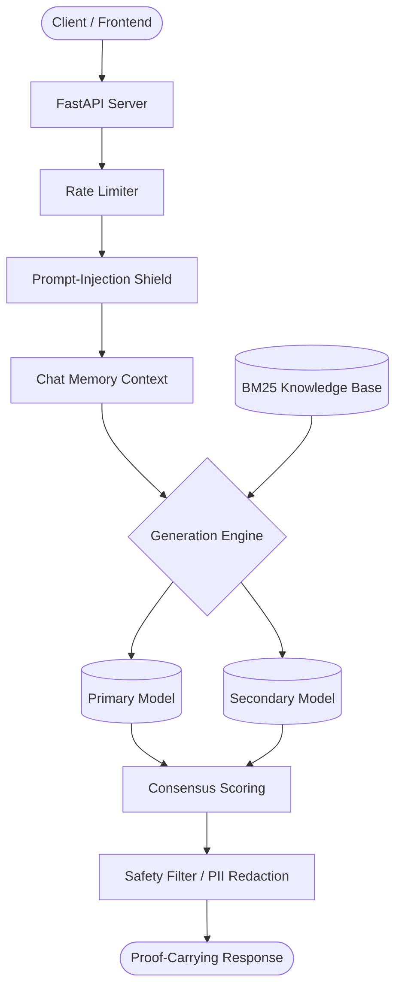

# EchoShield v2 🛡️

[](https://github.com/Avimuller1102/Offline-Assistant/actions/workflows/ci.yml)
[](https://www.python.org/downloads/)
[](https://opensource.org/licenses/MIT)
[](https://fastapi.tiangolo.com)

**EchoShield v2** is a fully offline, multilingual conversational AI engine designed for enterprise environments where data privacy, security, and absolute auditability are non-negotiable. It runs completely locally (zero network calls to external APIs), preventing data leaks and minimizing prompt-injection risks.

## 🎯 The Problem We Solve
In a world where enterprise data leaks via cloud LLMs are increasingly common, organizations are hesitant to adopt conversational AI for sensitive operations (HR, legal, finance, IP generation). Existing solutions either expose data to third-party APIs or lack the robust safety guarantees required by compliance frameworks.

## 💎 Value Proposition
EchoShield v2 provides **air-gapped AI capabilities** that are completely insulated from external networks. 
- **Absolute Privacy:** Runs on local hardware. Zero telemetry, zero external API dependencies.
- **Auditability:** Every answer is backed by a "proof-pack", linking generated claims to the verifiable local Knowledge Base.
- **Enterprise-Ready:** Delivered with a highly scalable FastAPI microservice layer for seamless integration into existing corporate infrastructure.

---

## 🚀 Key Features

*   **100% Offline Runtime:** All `transformers` models are loaded locally. Absolute privacy.
*   **Proof-Carrying Answers (PCA):** Responses are backed by a localized BM25 Knowledge Base, emitting an auditable "proof pack" validating every claim.
*   **Self-Consensus Decoding:** Leverages multi-candidate generation and agreement scoring to reduce hallucinations.
*   **Prompt-Injection Shield:** Built-in safeguards remove common hijack patterns and invisible unicode.
*   **Enterprise Integrations:** Exposes a robust REST API (FastAPI) and a CLI for terminal use.

## 🏗️ Architecture



---

## 💻 Quick Start

### 1. Installation

Clone the repository and use the provided `Makefile` to install the package and its dependencies.

```bash
git clone https://github.com/Avimuller1102/Offline-Assistant.git
cd Offline-Assistant
make install
```

> [!TIP]
> This command installs the core engine, CLI tools (`typer`), and the API server (`fastapi`, `uvicorn`).

### 2. Start the API Server

To expose EchoShield as a microservice for your applications:

```bash
make run-api
```
The API will be available at `http://127.0.0.1:8000`. You can test it by POSTing to `/chat`:
```bash
curl -X 'POST' \
  'http://127.0.0.1:8000/chat' \
  -H 'Content-Type: application/json' \
  -d '{
  "message": "Hello, how can you help me today?"
}'
```

### 3. Command Line Interface

For a quick terminal chat session, use the interactive CLI:

```bash
make cli
# or explicitly
echoshield chat --temperature 0.7
```

---

## 🧪 Development & Testing

We enforce strict code quality and ensure high reliability. 

```bash
# Run the test suite
make test

# Run the linter and formatter
make lint
```

## 🛡️ License
MIT License
